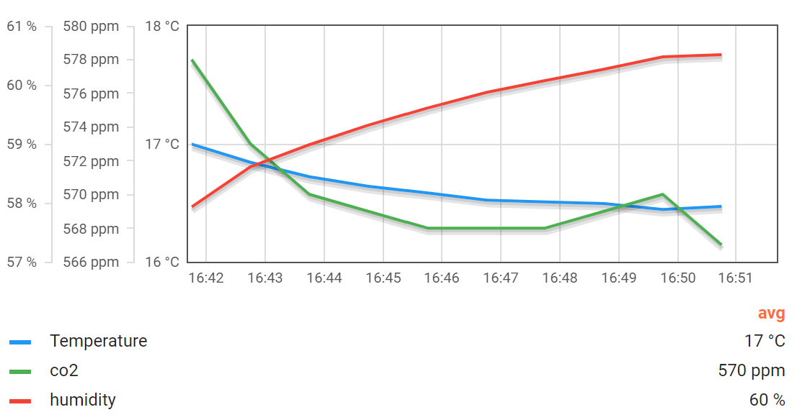

# Raspberry PI Pico W CO² Sensor #

> :information_source: I'm no Python developer so please be kind!

This is using a Raspberry PI Pico W with a [Pimoroni SCD41 CO2](https://shop.pimoroni.com/products/scd41-co2-sensor-breakout) sensor (and therefore base firmware).




Ensure you have a file called `./secrets.py` containing the following:

```python
WIFI_SSID = '<SSID>'
WIFI_PASSWORD = '<password>'
MQTT_HOST = '<hostname>'
MQTT_PORT = 8883
MQTT_USER = '<username>'
MQTT_PASS = '<password>'
```

And a `cert.der` that trusts the cert chain you're connecting to. To generate trust-store:

```bash
openssl s_client -connect <subdomain>.hivemq.cloud:8883 -showcerts < /dev/null 2> /dev/null | sed -n '/BEGIN/,/END/p' > <subdomain>.hivemq.cloud.pem

openssl x509 -in <subdomain>.hive.cloud.pem -out cert.der -outform DER
```
